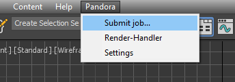
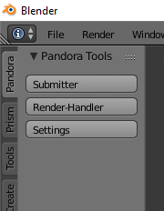
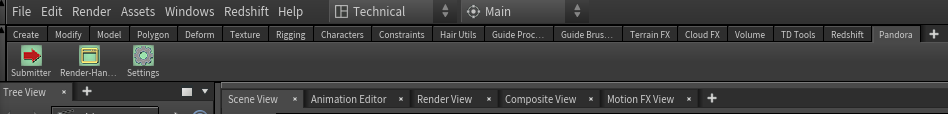
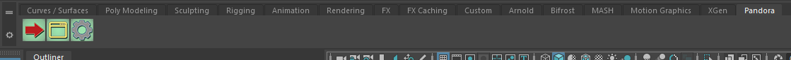
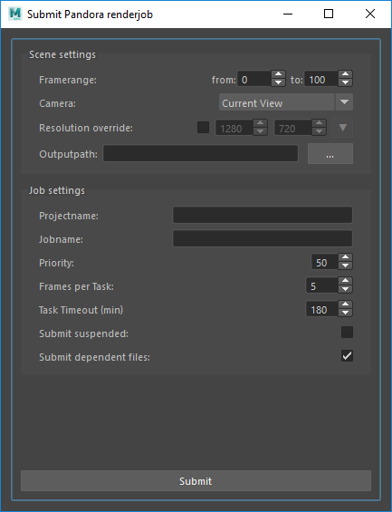
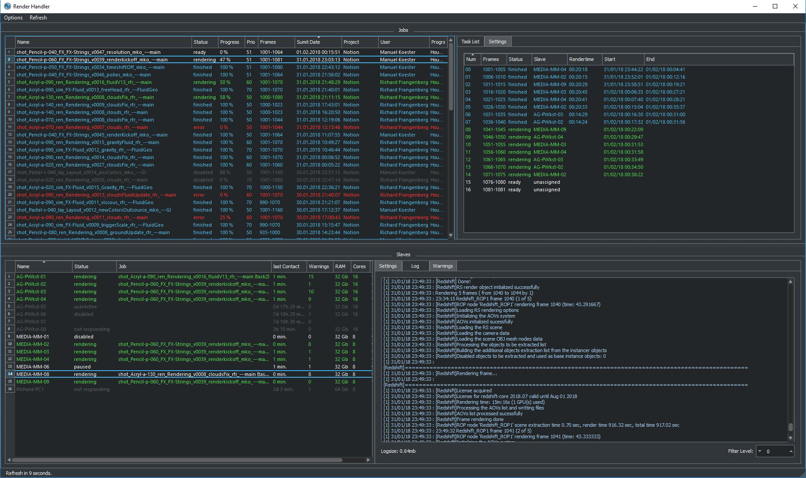
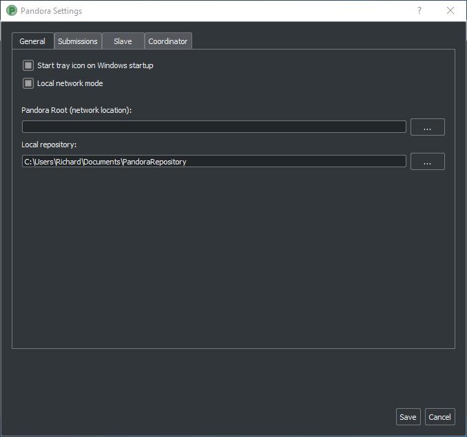

Feature Reference
*****************

.. _Installation:

Installation
===================

`Download <https://prism-pipeline.com/pandora/>`_ Pandora, run the executable and follow the instructions of the installer.
In some cases, Windows displays a warning, because the source of the installer is unknown to Windows.

You can ignore this warning by clicking on "More info" and then on the "Run anyway" button.

.. image:: images/windows-smartscreen.png

Follow the installer instructions.

On the last page of the installer there is are checkboxes called "Setup integrations", "Start Coordinator" and "Start Renderslave". "Setup integrations" displays a dialog for adding a Pandora shelf/menu to your 3d apps. You need this only on computers from which you want to submit renderjobs. The "Start Coordinator" launches the Pandora Coordinator tools, which assign the renderjobs to the slaves. One Coordinator is needed in a Pandora renderfarm. "Start Renderslave" launches the Pandora renderslave, which can be controlled by its tray icon. An additional Pandora tray icon launches at the end of the installation, which allows you to access all Pandora tools.

In the Windows start menu you can find the following tools now: "PandoraTray", "PandoraCoordinator", "PandoraSlave", "PandoraRenderHandler" and "Pandora Settings".
By default, the Pandora tray icon will start, when you start Windows. You can disable this in the "General" tab of the Pandora Settings dialog.

.. _dlgInstallation:

Setup Pandora integrations
--------------------------------

If you move the Pandora files to a different location or if you disabled the "Setup integrations" checkbox in the installer, you can use the "Setup_Integrations.bat" and "Setup_Startmenu.bat" in the Pandora installation folder to open a dialog, which lets you select for which programs you want to install the Pandora integration:

All supported DCC applications are listed here. The installer automatically detects which DCCs you have installed on your PC and enables the corresponding options. In most cases you can leave all settings to default. The "custom" options for 3ds Max and Maya can be used to install Pandora for additional versions like 2016.5.

If you want to install Pandora for a different DCC version, you can double click a path on the right side of the dialog. For 3ds Max and Maya this only works in the "custom" line. A new dialog opens and lets you select a different path (for example to install Pandora for an older Houdini version).

Uninstall
--------------------------------

To uninstall Pandora, you have to execute the "Uninstall.bat" in the Pandora installation folder. This will remove all Pandora integrations and links. Then you can delete the Pandora installation folder manually.
In some programs (like Houdini) the Pandora shelf needs to be deleted manually.

Setup the Coordinator on a server
===================================

You can setup the Pandora Coordinator on a server without the Pandora installer.

To do this you simply have to place the Coordinator python script in a specific folder:

First you need the PandoraCoordinator.py file.
You can find it on a PC, where Pandora was installed with the installer under this path:
C:/Pandora/Scripts/PandoraCoordinator.py
You can also download it from GitHub.

Then create a Pandora root folder somewhere on your server. Create "Scripts" and a "PandoraCoordinator" subfolders and place the PandoraCoordinator.py in there. The path has to look like this:
\.../Scripts/PandoraCoordinator/PandoraCoordinator.py

Now you can execute this script with Python 2.7. A log file called "PandoraCoordinator_Log.txt" will be created in the same folder and it should contain a line, which includes "starting Coordinator".

Now go to the computer, which you want to add as a renderslave or from which you want to submit renderjobs.
On this computer set the "Root" folder as the "Pandora Root" in the "General" tab of the Pandora Settings.

To close the PandoraCoordinator safely create a "EXIT.txt" file in the same folder, where the PandoraCoordinator.py is (or rename the EXIT-.txt to EXIT.txt).
You will see a "Coordinator closed" line in the Coordinator log file.

Setup Pandora with a Cloud-Service
===================================

Pandora can work in a mode, which doesn't require the computers (Coordinator, Submitters and Renderslaves) to be in the same local network.
This makes it very easy to add additional computers to a Pandora Renderfarm, because you don't need to move the computers physically. However in this mode the network traffic can be a bottleneck.

To connect the different computers you can use a Cloud-Service like Dropbox or GoogleDrive (in the following I'll use Dropbox as a representation for all cloud-services).

The setup is very similar to the usual local network setup. At first you need install Dropbox and Pandora on your computer. Setup Dropbox and create a folder on your harddrive, which will be synchronized to the cloud.
Then uncheck the "Local network mode" in the "General" tab on the Pandora Settings on every computer in the renderfarm (coordinator, slaves and submitters). You need to restart the coordinator and the renderslaves, if they are already running, when you change this setting.
Enable the Pandora Coordinator and make sure you set the "Pandora Root" folder in the "Coordinator" tab of the Pandora Settings to a location inside the Dropbox folder. The "Local Repository" folder on the "General" tab doesn't need to be in the Dropbox folder. Add new slaves and submitters in the "Coordinator" tab. The names of the slaves/submitters need to be the exact windows computer names. This will create folders in your Pandora root folder which you can synchronize to the slaves/submitters later.

On the renderslave and submitter computers install Dropbox and Pandora, too. You don't need to synchronize the complete Pandora Root folder to the harddrive of the Renderslaves. In the Dropbox options you can select to only synchronize the slave folder (e.g. Root/PandoraFarm/Slaves/S_Richard-PC1).

In the Pandora Settings in the "Slave" tab enable the slave and set the synchronized folder as the "Slave Root" path. (the same procedure applies to the submitters)

Integrations
===================

3dsMax
--------------------------------
In 3ds Max Pandora can be accessed from the "Pandora" menu in the main toolbar.

You can also access the Pandora tools in the "Customize User Interface" dialog in 3ds Max. You can find them in the group "Main UI", category "Pandora" and add them to a custom toolbar.
You can also find the tools in the global 3dsMax search (pressing "x" in the viewport), by typing the names you can find in the Pandora menu (like "Submit job..." or "Render-Handler")

Blender
--------------------------------

In Blender Pandora can be accessed from the "Pandora" panel on the left side of the Blender window.

You can also type the names on the buttons (like "Render-Handler") in the global search ("space" button) to open the Pandora tools.
Due to some limitations in Blender, the Pandora dialogs will be always on top of other dialogs from Blender and other programs.

Houdini
--------------------------------

In Houdini you can access the Pandora tools from the Pandora shelf in the top left shelf set.
If the shelf is not visible on your computer (for example because you use another Houdini desktop), you can add the "Pandora" shelf from the list of available shelves to any shelf set. The Pandora shelf is being created during the Houdini startup if it doesn't exist yet. To reset it to the default state you can delete the shelf and restart Houdini.

Maya
--------------------------------

In Maya you can access the Pandora tools from the Pandora shelf.

*Some users experienced missing icons on the Pandora shelf. In most cases this could be fixed by deleting the shelf manually and reinstalling Pandora.*

Standalone
--------------------------------

The standalone version of Pandora can be opened from the Pandora Tray icon or from the start menu. You can use it to manage your renderjobs and track the progress of them, but you cannot submit new jobs from it.

Pandora Dialogs
===================

Submit Pandora renderjob
--------------------------------

The Job submitter can be opened from the Pandora shelf/menu in any supported DCC application. It lets you submit the current scenefile as a renderjob to Pandora.

**Framerange:**

All frames between the "from" and "to" value will be rendered by Pandora for this renderjob.

**Camera:**

In this dropdown menu you can select a camera object from your scene, which will be used to render the job. The "Current View" option will render the current view, which is saved in the scenefile, but selecting a camera here is recommended.

**Resolution override:**

When this checkbox is checked, the renderjob will be rendered in the selected resolution (width - height). If unchecked, the resolution defined in the rendersettings of your scene will be used.

**Outputpath:**

Here you can define where the rendered images should be saved. If you are using the "local network mode" in the Pandora Settings, this path should be accessable for all renderslaves. The "..." button lets you select a directory in a file explorer.

**Projectname:**

This is the name of the project, to which this renderjob belongs to. It will be visible in Render Handler and allows to sort jobs by projectname. Many renderjobs can have the same projectname.

**Jobname:**

The jobname is the most important setting to identify a job in the Render Handler. Because of that the jobname should contain information about the content of this job like the shotnumber, task or version. It is possible to have multiple jobs with the same name, but to avoid confusion it is recommended to give every job a unique name.

**Priority:**

The priority of renderjobs defines the order in which the jobs will be rendered. The priority can be between 0 and 100. A higher value means the job will be rendered before a job with a lower priority value.

**Frames per Task:**

Sometimes also called chunksize. A renderjob will be splitted into multiple tasks. Each task can be assigned to a different renderslave, so the renderjob can be rendered by multiple slaves a the same time. This value means how many frames each task contains. When your renderjob has the framerange 1-120 and your Frames per Task value is 10, your job will be splitted into 12 tasks, each with 10 frames. If you want to render many frames, which are rendered very fast you can increase this value and if you want to render only few frames, which render very long you want to decrease this value.

**Task Timeout:**

This is the amount of minutes after which a task will be restartet, if a renderslave could finish it in this time. This avoids situations, where a renderslave freezes and blocks the current task forever.

**Submit suspended:**

If this option is checked, all tasks of this jobs will be disabled. They can be enabled manually in the Render Handler.

**Submit dependent files:**

If you have files in your scene, which are local on your computer, like textures or references, you can submit them together with your job. This is neccessarry for the renderslaves to have access to these files. If all your used textures are on network locations and accessable for every renderslave, you can disable this option.

**Submit:**
This button creates the renderjob with the settings defined above and sends it to Pandora.

Render Handler
--------------------------------

In the RenderHandler you can monitor all your renderjobs and renderslaves and the track the progress of your renderings. You can set various settings for the job and slaves or restart and disable individual tasks.

Menu bar
++++++++++++++++++++

**Options - Loglimit:**

This option restricts the displayed log entries in the Log tabs of the Render Handler. A value of 500 means the 500 newest entries will be displayed. Higher values show you more log entries, but this can cause reduced performance of the RenderHandler.

**Options - Refresh Interval:**

This value defines after how many seconds the Render Handler refreshes all its contents if the "Auto Update" option is checked.
In the lower left corner of the Render Handler you can see in how many seconds the next refresh will happen.

**Options - Auto Update:**

If this option is checked the Render Handler will refresh its contents every few seconds (defined by the "Refresh Interval" setting). If disabled you can use the "Refresh" option to manually refresh the Render Handler.

**Options - Show Coordinator:**

When this option is checked, additional tabs will become visible in the top right corner of the Render Handler. In these tabs informations and settings of the Coordinator is displayed. It can be used for debugging purposes.

**Options - Pandora Settings:**

This opens the Pandora Settings dialog.

**Refresh:**

This option refreshes the contents of the Render Handler.

**Help:**

This menu lets you open the official website, send feature requests to the developer and display information about Pandora.

Job list
++++++++++++++++++++

In the top-left area of the Render Handler there are all renderjobs listed with additional information like progress, priority or submit date. By default the list ist sorted by submit date, so the latest jobs are at the top. You can have an unlimited amount of jobs in this list, but it is recommended to remove unnecessarry or completed jobs from time to time.

From the context menu of the jobs you have various options. You can restart, disable or enable a job. This will restart/disable/enable all tasks of the current job at once.
You can delete a job, which removes the submitted scenefile, but the original scenefile and the renderoutput will remain unaffected.
You can open the job settings in your default text editor. This can be used for debugging purposes.
If the outputfolder exists, the option to open this folder in the windows explorer is enabled in the context menu.
If there are files inside the outputfolder and you have RV installed you can open the files directly from the context menu.

Task list
++++++++++++++++++++

The Task list is on the right of the job list and it shows all the tasks of the currently selected job in the job list. You can see the framerange, rendertime and status for every task here. Every task can be assigned to one renderslave. From the context menu you can restart, disable or enable individual tasks. You can select multiple tasks at once and for example restart them all simultaneously.

Settings (jobs)
++++++++++++++++++++

The Settings tab at the top right in the Render Handler displays all settings of the currently selected renderjob in the job list.
At the top of this list you have some settings which you can edit and below that there are a few job settings, which were set during the submission, which cannot be changed from the Render Handler.

The editable settings are:

**Listslaves:**

Here you can define, which renderslaves should be used to render the job. If you double click on the "value" column of this setting, the "Slave assignment" dialog opens. Here you can select which slaves or slavegroups should render or should be excluded from rendering this job.

**Priority:**
Same as in the Job Submitter.

**Task timeout:**
Same as in the Job Submitter.

Coordinator Log
++++++++++++++++++++

This tab is visible only if the "Show Coordinator" option is checked in the "Options" menu in the main menu bar.
Here you can see detailed information about everything the coordinator does like assigning jobs or sending commands to slaves. You can use the filter level to display only entries with a certain priority level (higher is more important).
From the context menu you can clear the log or open it in a text editor.

Coordinator Settings
+++++++++++++++++++++

This tab is visible only if the "Show Coordinator" option is checked in the "Options" menu in the main menu bar.
Here you can change the settings of the Pandora Coordinator.

The editable settings are:

**Command:**

This python expression will be executed by the Coordinator. It can be used to trigger specific functions in the coordinator script.

**Coordupdatetime:**

This is the interval in seconds in which the coordinator updates all job/slave status and assigns slaves to tasks.

**Debugmode:**

If this setting is checked, the Coordinator will print additional information in the Coordinator log.

Coordinator Warnings
+++++++++++++++++++++

This tab is visible only if the "Show Coordinator" option is checked in the "Options" menu in the main menu bar.
All warnings and errors from the Coordinator are listed here. By default each log entry with a priority 2 or higher creates a warning in this list. You can delete individual warnings or clear all warnings at once from the context menu.
Doubleclick a warning to see the complete warning in a popup

Slave List
+++++++++++++++++++++

In this list you can see all renderslaves, which are connected to Pandora. You can have an unlimited amount a slaves in this list. You can see the current status of the slave, the currently rendering task and other slave informations in this list. From the context menu you can open the Slave log or the Slave settings in a texteditor.

Settings (slaves)
+++++++++++++++++++++

This tab displays all the settings of the currently selected renderslave in the Slave list. The available settings are:

**Command:**

This string will be executed by the renderslave as a python expression. It can be used to trigger specific functions. From the context menu of the value column of this setting you can select a command from a few presets.

**Cursorcheck:**

If this setting is checked, the renderslave will check the mouse cursor before starting a rendering. If the cursor doesn't move, the slave assumes that nobody is using this PC at the moment and starts rendering. If the cursor does move, the rendering won't be started and the assigned task will be reassigned to another renderslave.

**Debugmode:**

If this setting is checked the renderslave prints additional information into its log.

**Enabled:**

If checked the slave is active and can render jobs. If unchecked the slave won't render any jobs.

**MaxCPU:**

If the CPU usage in percent on the renderslave is higher than this value, the renderslave won't start rendering.

**PreRenderWaitTime:**

If this setting is higher than 0, a popup will show up on the renderslave before starting a rendering. On the popup the user can press a button to say that he wants to use the PC and that the rendering should not start. This value defines the amount of seconds after which the popup closes and the rendering start if nobody pressed the "Don't render" button on this popup.

**Restperiod:**

If this setting is enabled, the both numbers define the time range of the day, in which the slave doesn't render any task.

**ShowInterruptWindow:**

If this setting is checked, a small window is visible during the rendering on the slave, which lets a user interrupt the current rendering easily.

**ShowSlaveWindow:**

If checked, a message will show up when the slave starts to notify the user that the PC is part of a renderfarm and that the PC shouldn't be turned off when the user leaves.

**SlaveGroup:**

Doubleclick this setting to edit it. Here you can define groups for your slaves. You can use the groups to assign renderjobs to groups instead of specific slaves.

**Updatetime:**

This defines the interval in seconds in which the Renderslave checks for commands and job assignments.

Log (slave)
++++++++++++++++++++

This tab displays the log of the currently selected renderslave in the Slave list.
You can use the filter level to display only entries with a certain priority level (higher is more important).
From the context menu you can clear the log or open it in a text editor.

Warnings (slave)
+++++++++++++++++++++

This tab displays the warnings of the currently selected renderslave in the Slave list.
All warnings and errors from the slave are listed here. By default each log entry with a priority 2 or higher creates a warning in this list. You can delete individual warnings or clear all warnings at once from the context menu.
Doubleclick a warning to see the complete warning in a popup

Pandora Settings
--------------------------------

The Pandora Settings dialog lets you define various global settings and directories, which Pandora uses to manage the renderjobs.

Tab General
++++++++++++++++++++

**Start tray icon on Windows startup:**

When this setting is enabled the Pandora Tray-Icon will be launched during the Windows startup. You can access all Pandora tool from the Tray-Icon.

**Local network mode:**

Enable this, when all your renderslaves are in the same network and have access to the outputpaths of the renderjobs. If you want to use remote renderslaves, which don't have access to the final outpaths of the renderjobs you want to disable this setting. In this case some options in the Pandora Settings dialog change.

**Pandora Root (local network mode enabled):**

This is the main Pandora directory. All submitter, renderslaves and the Coordinator need to have access to this folder. In most cases this is a network location.

**Local repository:**

Pandora saves different files in this directory based on the enabled components in the Pandora Settings. If the renderslave is enabled, all the jobs beeing rendered are copied to this folder. If the Coordinator is enabled, the global job repository will be saved in this folder.

**Local repository:**

This button lets you update the Pandora scripts directly from GitHub if you have git installed or from a .zip file from the GitHub repository.

Tab Submission
++++++++++++++++++++

This tab is visible if use have installed at least one Pandora integration for a DCC app.

**Job submission path (local network mode disabled):**

This directory defines in where the submitted jobs will be saved, when the local network mode is diabled. This has to be a subdirectory of the root path in the coordinator tab.
It has to look like this:
<CoordinatorRoot>/PandoraFarm/Workstations/WS_<Submitter-Computername>

You can create a new submitter in the Coordinator tab, rightclick on the new submitter, use "Copy path" and paste the path from your clipboard into this setting.

**Username:**

The name, which will be used to identify, which person created a renderjob.

Tab Slave
++++++++++++++++++++

**Enable Pandora Renderslave:**

Enable this option, if you want to use this computer as a renderslave.

**Slave Root (local network mode disabled):**

This directory defines in where new job assignments are saved, when the local network mode is diabled. This has to be a subdirectory of the root path in the coordinator tab.
It has to look like this:
<CoordinatorRoot>/PandoraFarm/Slaves/S_<Renderslave-Computername>

You can create a new slave in the Coordinator tab, rightclick on the new slave, use "Copy path" and paste the path from your clipboard into this setting.

**Start Pandora slave on Windows startup:**

If this option is enabled, the renderslave will be launched during the Windows startup. You will see the Tray-Icon of the renderslave, when the slave is running.

**Executable overrides:**

Pandora tries to find the correct application to render the jobs. If you want to define a specific version of a DCC app to render the jobs, you can select it here.

Tab Coordinator
++++++++++++++++++++

**Enable Pandora Coordinator:**

Enable this option, if you want to use this computer as the Coordinator. Only one computer in your renderfarm should have this setting enabled.

**Pandora Root (local network mode disabled):**

In this directory all renderjobs and renderings will be exchanged between the Coordinator, submitters and renderslaves.

**Start Pandora Coordinator on Windows startup:**

If this option is enabled, the Coordinator will be launched during the Windows startup.

**Slaves/Submiters (local network mode disabled):**

Here you can add new Renderslaves and Submitters to your renderfarm. The entered names should be the computernames of the slaves/submitters. You can copy the paths from the context menu of the slaves/sumitter and paste it into the "Job submission path" or "Slave root" parameters.