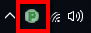

Getting Started
*****************

Installation
===================

Go to the downloads page and download the latest version of Pandora: https://prism-pipeline.com/pandora/
Follow the instructions of the :ref:`Installation<Installation>` section to set up Pandora on your PC.

You want to install Pandora on all your computers, where you want to use a part of Pandora. If you want to use the PC as a job submitter or as a renderslave can be defined later.

Configuring Pandora
====================

If you enable the checkboxes "Setup integrations", "Start Coordinator" and "Start Renderslave" at the end of the installation dialog, Pandora will be setup with the default settings and is immediately ready to use without any further configuration.

I case you want to change paths or some enable/disable components of Pandora you can go to the Pandora Settings. You can open this dialog from the context menu of the Pandora tray icon orby typing "PandoraSettings" in the windows startmenu search:

You can change the root and local repository if you like. By default this will be set to your Windows documents folder. The root path must be accessable from all submitters and renderslaves. If you have multiple computers, this is typically a network location.

If you enable the renderslave or the coordinator in the Pandora Settings tabs, they will be started as soon as you save the settings. Additionally you can start and stop them from the context menu of the tray icon.

The coordinator must be running to see the submitted renderjobs and their current status. At least one renderslave needs to be enabled in order to render a job.

Submitting a job
===================

To sumit a renderjob start your DCC app and open a scenefile, which you want to render.
From the Pandora shelf/menu open the Submitter tool. In this tool you have to set an outputpath, a projectname and a jobname. Then you can press "Submit" to send the job to Pandora.

If you use the Prism Pipeline, you don't need to use the Pandora submitter tool. Instead you can open the StateManager, create an ImageRender state in there you can enable the Pandora job submission. When you publish your scene now, Prism will send the job to Pandora.

Tracking the progress of the job
=================================

In the RenderHandler tool you can monitor the status and the progress of all your renderjobs. You can open the RenderHandler from the Pandora shelf/menu, from the start menu or from the Pandora tray icon.

In the top left list all renderjobs are listed and in the bottom left list you can see all your renderslaves. In the "Task List" tab at the upper right corner you can see a list of all tasks of the currently selected renderjob. There you can see whether a task is assigned to a slave or if it is already done.

You can open the output folder from the context menu of a job to view the final renderings. If you have RV installed you can also play the renderings in RV directly from the context menu in the RenderHandler